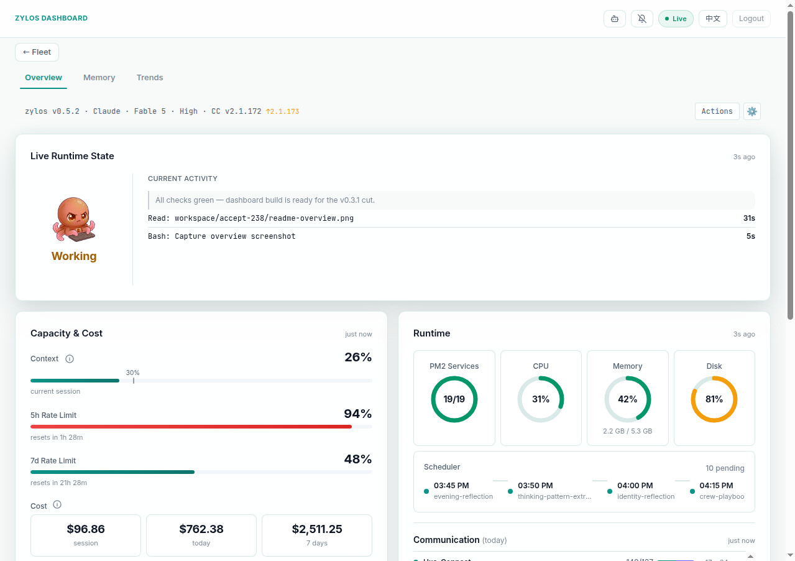

<p align="center">
  
</p>

<h1 align="center">zylos-dashboard</h1>

<p align="center">
  Read-only observability dashboard for Zylos AI agents.
</p>

<p align="center">
  <a href="./LICENSE"></a>
  <a href="https://nodejs.org/"></a>
  <a href="https://discord.gg/GS2J39EGff"></a>
  <a href="https://x.com/ZylosAI"></a>
  <a href="https://zylos.ai"></a>
  <a href="https://coco.xyz"></a>
</p>

---

<p align="center">
  
</p>
<p align="center">
  
</p>
<p align="center">
  
</p>

---

- **Real-time agent state** — idle, busy, stuck, waiting detection with tool activity feed
- **Capacity & cost tracking** — context usage, rate limits, session/daily/weekly cost
- **Actions modal** — runtime switch, model/effort change, threshold, zylos/CC upgrade
- **Full i18n** — English + Chinese with locale toggle
- **Codex compatible** — PM2, system health, communication, scheduler on all runtimes
- **Optional Observer** — authenticated terminal display; see [availability, setup and recovery](docs/observer.md)

## Install

```bash
zylos add dashboard
```

Or manually:

```bash
cd ~/zylos/.claude/skills
git clone https://github.com/zylos-ai/zylos-dashboard.git dashboard
cd dashboard && npm install
```

After install, restart the agent session to activate hooks.

## Configuration

All config lives in `~/zylos/components/dashboard/config.json`.

| Field | Default | Description |
|-------|---------|-------------|
| `port` | `3470` | Server port |
| `host` | `127.0.0.1` | Bind address |
| `ingestToken` | `null` | Bearer token for ingest API (optional defense-in-depth) |
| `auth.enabled` | `true` | Password authentication (enabled by default) |
| `auth.password` | auto-generated | Scrypt-hashed password |

On first install, a random password is generated and printed to the console:

```
Dashboard password: <hex string>
Save this — it won't be shown again.
```

### Model pricing

`runtimeModelPrices.<runtime>.<model>` replaces a whole default price row. Rates
are USD per million tokens: `input`, `output`, `cacheRead`, and `cacheCreation`.
Built-in Codex price keys match exact model IDs or their `-YYYY-MM-DD` snapshots,
even when their rates are overridden or saved through Settings. Custom keys
outside the built-in model list retain prefix matching (for example,
`vendor-model` covers `vendor-model-pro`). The longest matching key wins in both
standard and Priority tables. Unknown generations such as `gpt-5.7` remain
unpriced unless a custom key covers them.
For Codex GPT-5.6/Astra, cache writes use a separate replacement rate; they are
subtracted from total input before ordinary input is priced. For Claude,
`cacheCreation` is the one-hour rate; five-minute writes use 1.25× input.

Codex rows may include `longContext` with `inputTokenThreshold` and the same four
rate fields. When a request's total input (including cache reads/writes) is
**greater than** the threshold, those rates apply to the whole request. A custom
row without `longContext` stays at its supplied rates. Priority/Fast rows live in
`runtimeServiceTierModelPrices.codex.priority` and use the same shape. Defaults
were checked against [OpenAI API pricing](https://developers.openai.com/api/docs/pricing)
on 2026-09-15; Sol's promotional price is available at least through 2026-11-21.
Cumulative-only usage cannot establish a request's context tier: its existing
base-rate estimate is retained with `cost_estimation_note: cannot_determine_request_context`.
Stored usage records are not migrated or repriced on replay.

Claude rows may include `fastModeMultiplier`; current Opus 5 and Opus 4.8 use 2
([Claude pricing](https://platform.claude.com/docs/en/about-claude/pricing)).
An explicitly configured `runtimeFastModeMultipliers.claude` (or legacy
`fastModeMultiplier`) wins over the model default. Without an explicit override,
the model default wins over the legacy fallback of 6. Other models retain their
previous treatment. Settings exposes this distinction as
`fastMode.configuredMultiplier` (`null` means no global override); saving prices
without sending `fastModeMultiplier` leaves the override unchanged. Sending
`fastModeMultiplier: null` (clearing the field) removes the global override and
restores model defaults immediately and after restart.

## Access

The dashboard is served at `/dashboard/` through the Caddy reverse proxy:

```
https://<your-host>/dashboard/
```

## Architecture

```
Claude Code hooks --> hook-ingest.cjs --> /api/ingest --> SQLite DB
                                                             |
statusline.json (core) --> StatuslineCollector ---------------+
                                                             |
PM2 / System collectors ------------------------------------- +
                                                             v
                                                    State Engine --> SSE --> Browser
```

Data flows:
- **Hook events**: Claude Code hook scripts POST to `/api/ingest` (with offline spool fallback)
- **Metrics**: StatuslineCollector reads core's `statusline.json` via file polling
- **System**: PM2 and system collectors poll at intervals
- **Frontend**: SSE stream with polling fallback; i18n via JSON locale files

## Development

```bash
npm start          # Start server
npm test           # Run tests
npm run check      # Syntax check all files
npm run smoke      # Smoke test (start + verify)
```

## License

[MIT](./LICENSE)
