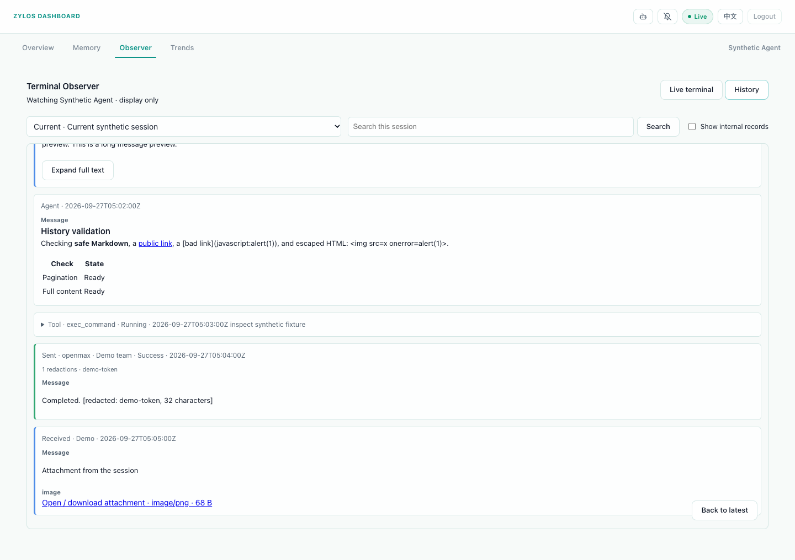
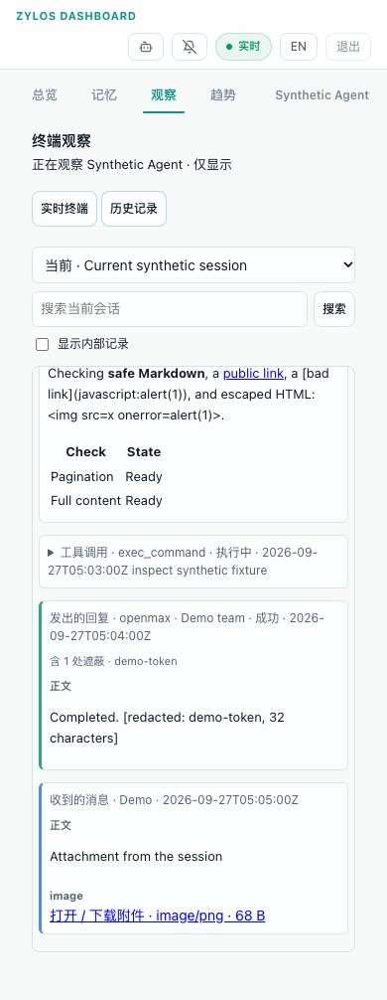

# Observer history implementation validation

Validated against base `a3f3858` (Dashboard PR #304), using synthetic credentials
and sanitized runtime-format fixtures. This is S2 implementation evidence;
independent review and post-release installation acceptance remain separate.

## Automated checks

- Full suite: **885/885 passed** with
  `env -u CLAUDE_SESSION_ID -u CODEX_SESSION_ID npm test`.
  The two session-ID variables are removed because the pre-existing state-engine
  fallback test otherwise reads the surrounding agent's active session.
- `npm run check` and `git diff --check` passed.
- Production parser → history service → redactor tests recover full C4 messages,
  Claude persisted tool output and Codex aggregated command output. Segments
  reconstruct the complete redacted source, including Unicode and credentials
  crossing the 256 KiB boundary.
- Read-only fixture files/directories retain their hashes and modification times.
  Path tests reject traversal, foreign paths, symlinks and transcript replacement
  with a symlink. Index tests cover incomplete tails, growth during reads,
  replacement, 17 MiB records, deferred PDF expansion and LRU retention.
- API tests cover no-auth/read/admin admission, enabled gating, every text output,
  content headers, stable paging, internal records, search, and late tool updates.
  An injected terminal/lease operation throws if history touches it.
- Fleet tests exercise all four allowlisted GET routes, admin scope and the
  retained response leak guard.
- Negative controls remove queued-command handling, remove L2 detection and
  bypass service redaction. Each is rejected by its corresponding acceptance
  predicate; the unchanged implementations pass.
- Pinned rule generation is byte-reproducible. The dedicated 1,016,000-byte
  adversarial regex fixture took **13.468 ms**, below the 200 ms threshold.
  Worker output equivalence, zero-deadline fail-closed behavior and known
  value reload/failure are tested.

## R1 review corrections

The initial single adversarial fixture did not establish safety across structural
scanners. Review found quadratic key/value and query scans; R1 anchors those
scanners and the independently reproduced URL-scheme case. Four 160 KiB patterns
(`a.`, `a-`, `foo.bar-baz.`, `?a`) now complete in 3.0–3.7 ms in isolated local
measurements. Reverting each of the three scanner fixes independently causes its
negative-control child process to exceed a 1.5-second deadline.

Every uncached field now uses one reusable worker per redactor, including short
fields. R1 initially capped the queue at 128 active/waiting jobs (revised in R2 below);
the five-second production deadline covers queue time and execution. Tests cover
bursts, close, concurrent deadlines, worker replacement and recovery. An HTTP regression runs the actual
ObserverService, HistoryService and redactor with an injected worker stalled on a
four-character field: health responds while history is pending, the injected
one-second deadline hides the content, and a later credential scan succeeds.

Known-value detection now requires at least eight characters and excludes trivial
values. Structural detection preserves session identifiers, session names and
bare key/auth metadata while retaining credential-specific fields. Positive
credential controls and source mutants cover both filtering changes.

Claude session metadata uses lightweight incremental cursors; appended parser records
are read in batches through one descriptor. Instrumented file reads verify zero
transcript bytes on unchanged polls and three reads of only the appended range
for metadata listing plus index/parser update. In one synthetic local run, 78 files
(157.96 MiB) took 84.34 ms to list cold; five 981-byte appends to a roughly 20 MiB
active transcript took 1.07–1.48 ms for listing and 0.20–0.29 ms for parser loading,
with exactly three opens and 2,943 bytes per cycle. These are parser measurements
on cached filesystem pages, not full HTTP latency or cross-machine guarantees.

History admission now reads fresh enablement and installation metadata without
hashing or executing the terminal artifact. Tests verify no artifact read/exec on
this path, fresh disablement, and retained full verification for launch/install.

The R1 874-test run included all six added queue/source-mutant tests. Syntax and
diff checks pass. R1 changes no frontend files; the original eight browser cases
below remain the UI evidence. S3 approved R1; the R2 follow-up requires re-review.

## R2 queue admission correction

Owner-requested follow-up removes the fixed 128-job admission rejection. Bursts
wait on the existing single worker instead of immediately becoming unavailable.
Each job retains the five-second deadline measured from enqueue through execution;
real deadline expiry and scanner failure still hide content, and shutdown resolves
pending work. This keeps one worker per redactor without spawning workers per
request. Sustained load that exceeds the deadline can still time out safely.

The worker regression submits 200 jobs behind a blocked job, releases it, and
verifies every result comes from the same worker. Existing close, concurrent
queue-deadline, replacement and HTTP-stall tests continue to cover failure paths.

HTTP tests use the production ObserverService, HistoryService and redactor with
synthetic records. One cold `internal=1&limit=200` page and four concurrent cold
200-entry pages (distinct sessions/values) return all fields, with exact previews,
totals, entry ordering and credential masking checked. Reinstating the 128-job
rejection in an isolated copy of the production worker client makes the same
availability predicate fail for both single and concurrent requests; credentials
remain hidden in that negative control. These fixtures validate queue admission,
not throughput guarantees for arbitrary transcript sizes or sustained overload.

The integrated R2 suite passes **877/877**; syntax and diff checks also pass.

## R3 metadata cache retention

Claude and Codex metadata caches now retain entries for the eligible transcript
files encountered by each session-list scan, and discard entries absent from that
scan. Claude's fixed 256-entry eviction is removed: visiting every file in a list
larger than the cap previously evicted warm entries before they could be reused.
Codex tracks files before filtering subagent sessions from the visible list, so
hidden subagent metadata remains reusable. If the transcript root disappears,
both parsers clear stale metadata and session paths.

This metadata remains in memory and scales with the currently discovered files;
it has no fixed entry-count limit. The separate eight-file parsed-session index
cache is unchanged. No transcript or database records are modified by cleanup.

Eight regressions instrument actual transcript opens and bytes read. Claude and
Codex each use 260 synthetic files, with positive cold-read controls and two
consecutive warm listings that perform zero transcript opens/reads. Tests also
verify deleted-file cleanup with stale Codex store rows, root disappearance, and
retention then deletion of a hidden Codex subagent. Reinstating Claude's fixed
256-entry eviction in an isolated source mutant makes the same warm-list
acceptance fail with observed file rereads. The integrated R3 suite passes
**885/885**; syntax and diff checks also pass.

## Browser checks

Actual shipped HTML/JS/CSS ran in isolated Chromium with synthetic HTTP APIs.
Eight cases cover 1440 px and 390 px, English and Chinese, and light/dark OS
preferences. Dashboard currently ships only the light theme; dark preference
therefore validates that supported theme, not an invented dark theme.

All cases had no document overflow or page errors. The terminal iframe, its
window and its source remained identical across view toggles; lease acquisition
counts did not increase. Interactions checked 300 KB exact full-text loading,
search-to-entry, older pagination, session switching, internal visibility, late
updates, and stopping polling when leaving Observer. Hidden-document handling
was exercised with a simulated visibility event in headless Chromium.

## Scope and remaining acceptance

The bundled selection uses all 221 Gitleaks text rules (222 definitions including
the inapplicable path-only rule) and six additional high-confidence Betterleaks
vendor rules. Mistral and Lark lack the selected confidence/prefix properties;
known-value and structural credential detection still cover their secret fields.
Exact provenance and selected filter semantics are documented beside the rules.

Oversized JSONL lines are deferred until explicit expansion, including when
searching. Binary content, encoded credentials and live terminal redaction remain
outside textual history redaction. No show-original endpoint exists.

No release, deployment or live runtime modification was performed. S4 still
requires the agreed installed-instance checks: real Claude/Codex record matching,
C4 and full-output comparison, polling and redaction, remote Fleet, read-token
rejection, and unchanged agent/tmux state during use.
